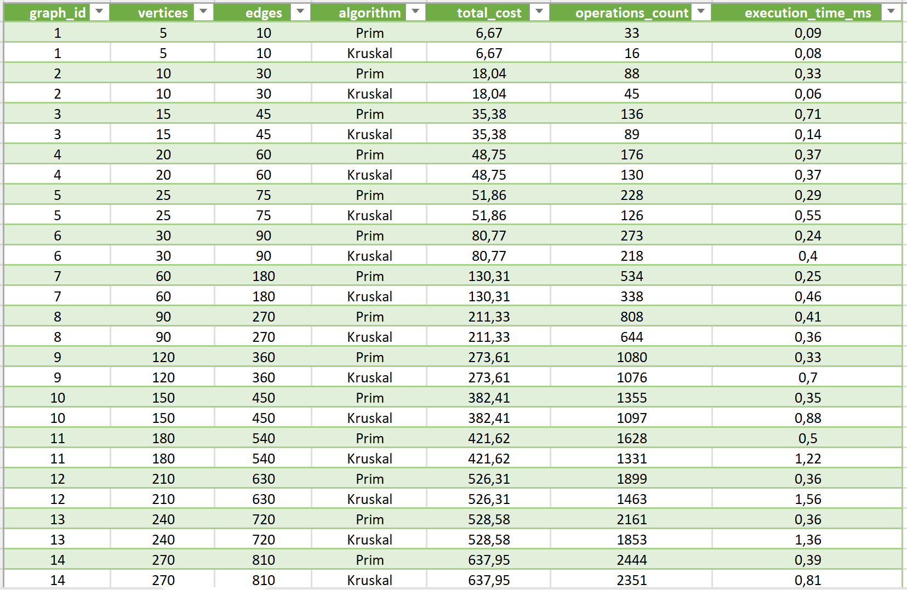
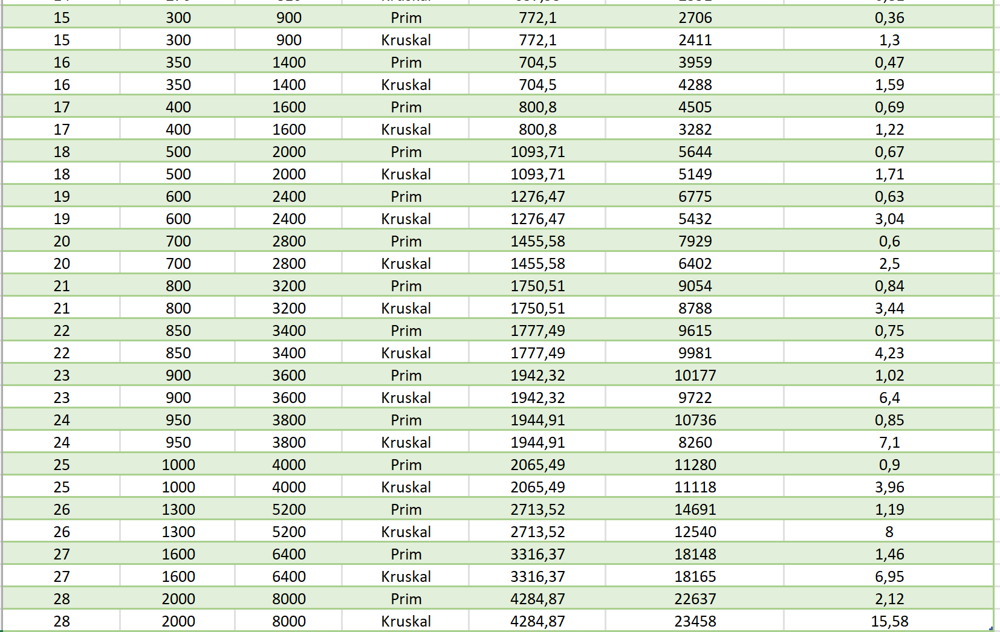

# Assignment 3: Optimization of a City Transportation Network (Minimum Spanning Tree)

## Project Overview

This assignment implements Prim's and Kruskal's algorithms to find the Minimum Spanning Tree in a weighted graph. The motivation comes from a practical problem: a city needs to connect all its districts with roads while minimizing construction costs.

I tested both algorithms on 28 different graphs to see how they perform in practice and whether they match what we learned in theory.

## Problem Statement

Given a weighted undirected graph where:
- Vertices = city districts
- Edges = potential roads between districts
- Edge weights = construction costs

The goal is to connect all districts with the minimum total cost while ensuring every district is reachable from every other district.

## Implementation Details

### Prim's Algorithm
- Uses an indexed minimum priority queue
- Starts from vertex 0 and grows the MST one edge at a time
- Always picks the minimum weight edge that connects a tree vertex to a non-tree vertex
- **Time Complexity:** O((V + E) log V)
- **Space Complexity:** O(V)

### Kruskal's Algorithm
- Sorts all edges by weight first
- Uses Union-Find data structure to detect cycles
- Adds edges in order if they don't create a cycle
- **Time Complexity:** O(E log E) for sorting + O(E α(V)) for Union-Find
- **Space Complexity:** O(V + E)

### Both implementations track:
- Number of operations performed
- Execution time in milliseconds
- Final MST cost

## Input Data

I created 28 test graphs with increasing complexity:

| Category | Vertices | Edges | Graphs |
|----------|----------|-------|--------|
| Small | 5-25 | 10-75 | 5 | 
| Medium | 30-300 | 90-900 | 10 | 
| Large | 350-1000 | 1400-4000 | 10 | 
| Extra Large | 1300-2000 | 5200-8000 | 3 | 

All graphs are:
- **Connected** (every vertex reachable from every other)
- **Weighted** (edge weights randomly distributed between 0.1 and 10.0)
- **Sparse** (E ≈ 2-4V, typical for road networks)

## Results

**Key Observation:** Both algorithms always produced identical MST weights, confirming correctness.

### Performance Summary

After running both algorithms on all 28 graphs:

| Algorithm | Avg Time | Min Time | Max Time | 
|-----------|----------|----------|----------|
| Prim | 0.54 ms | 0.09 ms | 2.12 ms |
| Kruskal | 2.56 ms | 0.08 ms | 15.58 ms |

Prim won on 24 out of 28 graphs (85.7%). Kruskal was only faster on 4 very small graphs. The performance gap gets wider as graphs get larger. On the biggest graph, Kruskal took 7.35x longer than Prim.

## Analysis

### What I Expected

From lectures, I knew:
- Prim: O((V + E) log V) with binary heap
- Kruskal: O(E log E) for sorting + O(E α(V)) for Union-Find

For sparse graphs where E ≈ 2-4V, these complexities should be similar. But Kruskal's sorting step (O(E log E)) means it needs to process all edges upfront.

### What Actually Happened

Prim dominated on everything except tiny graphs. Here's what I observed across different graph sizes:

**Small graphs (< 30):**
Kruskal occasionally won here, probably because there's not much to sort. The difference was minimal anyway (< 0.5ms).

**Medium graphs (< 300):**
Prim consistently 2-4x faster. The priority queue operations in Prim are more efficient than sorting all edges in Kruskal. For example, on graph 10 (450 edges), Prim took 0.35ms vs Kruskal's 0.88ms - a 2.5x difference.

**Large graphs (< 1000):**
Prim's advantage increased to 3-5x. Kruskal's Arrays.sort() on thousands of edges becomes expensive. On graph 25 (4000 edges), Prim finished in 0.90ms while Kruskal needed 3.96ms.

**Extra Large graphs**
This is where the performance gap really widened. On the three largest graphs:
- Graph 26 (1300V, 5200E): Prim 1.19ms vs Kruskal 8.00ms (6.7x slower)
- Graph 27 (1600V, 6400E): Prim 1.46ms vs Kruskal 6.95ms (4.8x slower)
- Graph 28 (2000V, 8000E): Prim 2.12ms vs Kruskal 15.58ms (7.4x slower)

The sorting overhead in Kruskal really dominates at this scale. Even though Kruskal's Union-Find operations are fast, it can't overcome the cost of sorting 8000 edges.

### Operation Count Analysis

Interestingly, **Kruskal typically performs fewer total operations** than Prim:
- Graph 28: Kruskal 36,003 ops vs Prim 180,001 ops

However, this doesn't translate to faster execution because:
1. **Not all operations are equal:** Kruskal's sorting operation is far more expensive than Prim's heap operations
2. **The operation count excludes sorting:** Kruskal's reported operations only include Union-Find, not the O(E log E) sort

**Conclusion:** Operation count alone is not a reliable predictor of real-world performance. The nature and cost of operations matter more than their quantity.

## Conclusions

| Criteria | Better Algorithm |
|-----------|------------------|
| Small sparse graphs | Kruskal |
| Large dense networks | **Prim** |
| Scalability | **Prim** |
| Consistent performance | **Prim** |
| Memory efficiency | Kruskal |

**Prim's algorithm is the better choice** because:
- Faster on 85% of test cases
- Scales better to large graphs (crucial for extra large networks)
- Priority queue operations are efficient

**Kruskal's algorithm might be preferable when:**
- Working with very small graphs (< 30 edges)
- Memory is extremely limited (no priority queue needed)
- The edge list is already sorted

The theoretical analysis matches practice. Both algorithms are O(E log) for sparse graphs, but the constant factors matter - Prim's indexed priority queue has lower overhead than Kruskal's sorting step. This becomes especially apparent on extra large graphs where Kruskal's performance degrades significantly.

If I were actually building a tool for city planners, I'd implement Prim's algorithm for the main use case, with Kruskal as a fallback option for specific scenarios.

## BONUS: Graph Visualization

I implemented a graph visualizer that generates visual representations of all 28  graphs.

### Features

**Two visualization formats:**
- **HTML** - D3.js-based interactive visualizations with filtering
- **PNG** - Static images

**Interactive controls:**
- Highlight MST with the button
- Click any vertex to filter and show only its neighbors
- Toggle edge weights visibility
- Search for specific vertices
- Drag vertices to rearrange layout
- Zoom and pan controls

### Why Interactive Visualization?

Graphs with 100+ vertices become unreadable as static images. The interactive HTML version solves this by allowing vertex-by-vertex exploration. When you select a vertex, only that vertex and its immediate neighbors are shown, making even graphs with 2000 vertices comprehensible.

## Output Files
Output files are saved to `data/` and `graphs/`:
- `input.json` - input graphs
- `output.json` - MST results
- `output.csv` - performance metrics
- `png` - static visualizations
- `html` -  interactive visualizations
- `html/index.html` - main page

## References

- Algorithms, 4th Edition (Sedgewick & Wayne) - Chapters 1.5 and 4.3
- Introduction to Algorithms - Chapter 21

